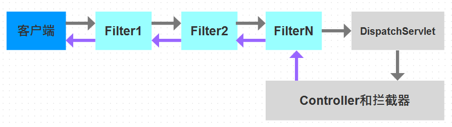
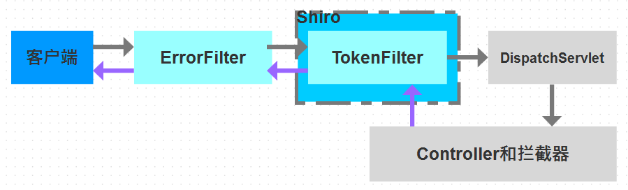
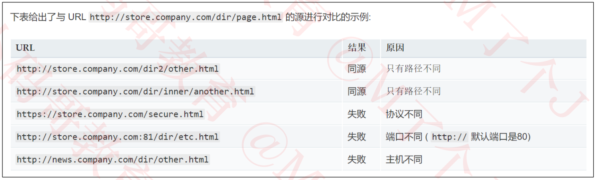

## 一、前后端的接口设计
- 先来认识一下在阿里巴巴的开发手册定义的各种Object
  ```reStructuredText
  1> PO (Persistent Object): 持久化对象
     属性跟数据库表的字段对应，一个PO对象对应数据库表的一条记录
  2> DTO (Data Transfer Object): 数据传输对象
     很多时候并不需要PO的所有属性（数据库表的所有字段）传输给客户端（根据客户端的业务需要对PO属性进行删减重新组装DTO对象
  3> VO (View Object): 视图对象
     传输给客户端的数据展示对象，通常对应一个页面
     业务字段的值和最终展示的值是不一样的，比如在DTO中，sex的值是0和1，而在页面A的VO中，sex的值是男生和女生
  ```
- 为了配合前端的Layui-mini框架，设计了以下几种返回给前端的数据结构（PO和DTO过于简单这里不再赘述
  ```reStructuredText
  1> JsonVo: 面向客户端的普通Json格式Vo
     一般用于返回“成功”或“失败”的信息（多见于save、remove之类的方法中
  2> PageVo<T>: 用于存储从DB得到的分页数据
  3> DataJsonVo<T>: 面向客户端的普通数据信息（额外附带msg）Vo
     一般用于返回给前端页面的数据（不用于页面的表格展示
  4> ViewJsonVo<T>: 面向客户端的分页信息Vo
     一般用于返回给前端页面的表格（带有分页的那种）（多见于list之类的方法中
  -------------------------------------------------------------------
  5> LoginVo: 面向客户端的登录成功后的结果Vo，登录成功后会保存在用户本地的Token中
  -------------------------------------------------------------------
  6> XxxxxxVo: 普通VO
  -------------------------------------------------------------------
  7> XxxxxxReqVo: 前端传进来的请求参数（用于检索
  8> XxxxxxReqSaveVo: 前端传进来的请求参数（用于登录
  ```
## 二、Springboot
- 通过maven导入jar包
- 添加配置文件
- 添加mapper、service以及controller
- 启动springboot
## 三、模块介绍-异常处理
- SpringMVC的执行流程大概可以简化为：客户端 -> Filter -> DispatchServlet -> controller和拦截器
  
- 使用注解@ExceptionHandler + @ControllerAdvice的方式进行异常处理
  ```reStructuredText
  思路说明：
  1> 使用@ExceptionHandler单独写个处理异常的类，再配合注解@ControllerAdvice
     👉 默认行为（即，如果没有任何选择器使用），带@ControllerAdvice注释的类将协助所有已知的控制器
  2> 注意Filter链如果发生了异常，是无法捕获到的，所以得手动转发给异常处理类
  ```
- 代码实现说明（详细请直接查阅相关代码 
  ```java
  package com.lding.pmbok.common.exception;
  
  /**
   * 自定义异常
   */
  public class CommonException extends RuntimeException {
      private final int code;
  
      public CommonException() {
          this(CodeMsg.BAD_REQUEST.getCode(), null);
      }
      
      // 省略一万行代码（为了缩减篇幅
  }
  ```
  ```java
  package com.lding.pmbok.common.exception;
  
  @RestControllerAdvice
  // 该注解相当于@ControllerAdvice+@ResponseBody 可以实现三个方面的功能：全局异常处理、全局数据绑定、全局数据预处理
  // 默认行为（即，如果没有任何选择器使用），带@ControllerAdvice注释的类将协助所有已知的控制器
  @Slf4j
  public class CommonExceptionHandler {
      @ExceptionHandler(Throwable.class) // 可以指定异常类型的范围
      @ResponseStatus(code = HttpStatus.BAD_REQUEST)
      public JsonVo handle(Throwable t) {
          log.error("handle", t);
  
     		// 省略一万行代码（为了缩减篇幅
  
          // 其他异常（没有cause的异常）
          return JsonVos.error();
      }
      // 省略一万行代码（为了缩减篇幅
  }
  ```
  ***
  ```java
  package com.lding.pmbok.filter;
  
  /**
   * 自定义具体的过滤器（需要实现javax.servlet.Filter接口
   */
  @Component
  public class ErrorFilter implements Filter {
      public static final String ERROR_URI = "/handleError";
  
      @Override
      public void doFilter(ServletRequest request, ServletResponse response, FilterChain chain) throws IOException, ServletException {
          try {
              chain.doFilter(request, response);
          } catch (Exception e) { // 过滤器链出问题后，转发到异常处理的controller 统一处理
              request.setAttribute(ERROR_URI, e);
              request.getRequestDispatcher(ERROR_URI).forward(request, response);
          }
      }
  }
  ```
  ```java
  package com.lding.pmbok.controller;
  
  @RestController
  public class ErrorController { // 异常处理Controller（主要接受来自过滤器链来的异常）后面会被CommonExceptionHandler统一处理
      @RequestMapping(ErrorFilter.ERROR_URI)
      public void handle(HttpServletRequest request) throws Exception {
          // 抛出异常
          throw (Exception) request.getAttribute(ErrorFilter.ERROR_URI);
      }
  }
  ```
## 四、模块介绍-MybatisPlus
- 相关jar包引入
  ```xml
  <!-- 数据库 -->
  <dependency>
      <groupId>mysql</groupId>
      <artifactId>mysql-connector-java</artifactId>
  </dependency>
  <dependency>
      <groupId>com.alibaba</groupId>
      <artifactId>druid-spring-boot-starter</artifactId>
      <version>1.2.9</version>
  </dependency>
  <dependency>
      <groupId>com.baomidou</groupId>
      <artifactId>mybatis-plus-boot-starter</artifactId>
      <version>3.4.2</version>
  </dependency>
  ```
- 相关配置
  ```java
  package com.lding.pmbok.common.config;
  
  import com.baomidou.mybatisplus.annotation.DbType;
  import com.baomidou.mybatisplus.autoconfigure.ConfigurationCustomizer;
  import com.baomidou.mybatisplus.extension.plugins.MybatisPlusInterceptor;
  import com.baomidou.mybatisplus.extension.plugins.inner.PaginationInnerInterceptor;
  import org.mybatis.spring.annotation.MapperScan;
  import org.springframework.beans.factory.InitializingBean;
  import org.springframework.context.annotation.Bean;
  import org.springframework.context.annotation.Configuration;
  
  /**
   * 自定义myBatisPlus配置文件
   * @author lding
   */
  @Configuration
  @MapperScan("com.lding.pmbok.mapper")
  public class MyBatisPlusCfg implements InitializingBean {
      @Bean
      public MybatisPlusInterceptor mybatisPlusInterceptor() {
          MybatisPlusInterceptor interceptor = new MybatisPlusInterceptor();
          PaginationInnerInterceptor innerInterceptor = new PaginationInnerInterceptor(DbType.MYSQL);
          // 当页数超过总页数时，自动跳回到第1页
          innerInterceptor.setOverflow(true);
          interceptor.addInnerInterceptor(innerInterceptor);
          return interceptor;
      }
  
      @Bean
      public ConfigurationCustomizer configurationCustomizer() {
          return configuration -> configuration.setUseDeprecatedExecutor(false);
      }
  }
  ```
  ```yaml
  # 配置文件application.yml
  spring:
    # 设置DB数据源
    datasource:
      type: com.alibaba.druid.pool.DruidDataSource
      driver-class-name: com.mysql.cj.jdbc.Driver
      username: root
      password: sysapl
      url: jdbc:mysql://localhost:3306/pmbok_sys?serverTimezone=Asia/Tokyo&useUnicode=true&characterEncoding=UTF8
      druid:
        initial-size: 5
        max-active: 10
  mybatis-plus:
    # 配置mybatis-plus
    type-aliases-package: com.lding.pmbok.pojo
    configuration:
      use-generated-keys: true
    global-config:
      db-config:
        id-type: auto
  ```
  ***
  ```java
  package com.lding.pmbok;
  
  import org.springframework.boot.SpringApplication;
  import org.springframework.boot.autoconfigure.SpringBootApplication;
  
  /**
   *  - @SpringBootApplication 里面包含了3个注解
   *  - @EnableAutoConfiguration 可以根据maven依赖自动构建相关环境（比如为spring-boot-starter-web构建web容器环境等）
   *  - @ComponentScan 默认会扫描当前包以及子包中的所有类
   *  - @SpringBootConfiguration 暂时无视，之后细说
   */
  @SpringBootApplication
  public class Application {
      static {
          // 解决druid 日志报错：discard long time none received connection:xxx
          System.setProperty("druid.mysql.usePingMethod", "false");
      }
  
      public static void main(String[] args) {
          SpringApplication.run(Application.class, args);
      }
  }
  ```
- 项目代码演示
  ```java
  package com.lding.pmbok.pojo.po;
  
  import com.lding.pmbok.common.foreign.anno.ForeignField;
  import lombok.Data;
  
  @Data
  public class DictItem {
      // 主键
      private Integer id;
  
      // 名称
      private String name;
  
      // 值
      private String value;
  
      // 排列顺序，默认0。值越大，就排在越前面
      private Integer sn;
  
      // 是否禁用。0代表不禁用（启用），1代表禁用
      private Short disabled;
  
      // 所属的类型
      @ForeignField(DictType.class)
      private Integer typeId;
  }
  ```
  ```java
  package com.lding.pmbok.mapper;
  
  import com.baomidou.mybatisplus.core.mapper.BaseMapper;
  import com.lding.pmbok.pojo.po.DictItem;
  
  public interface DictItemMapper extends BaseMapper<DictItem> {
      // 继承mybatisPlus的BaseMapper<PO>
  }
  ```
  ```java
  package com.lding.pmbok.service;
  
  import com.baomidou.mybatisplus.extension.service.IService;
  import com.lding.pmbok.pojo.po.DictItem;
  import com.lding.pmbok.pojo.vo.PageVo;
  import com.lding.pmbok.pojo.vo.req.select.DictItemPageReqVo;
  import com.lding.pmbok.pojo.vo.resp.DictItemVo;
  
  // 配合BaseMapper 一旦继承了MybatisPlus的IService<PO>类 就可以自动实现当前Mapper对应的table的增删改查
  public interface DictItemService extends IService<DictItem> {    
      PageVo<DictItemVo> getTargetList(DictItemPageReqVo query);
  }
  ```
  ```java
  package com.lding.pmbok.service.impl;
  
  import com.baomidou.mybatisplus.extension.service.impl.ServiceImpl;
  import com.lding.pmbok.common.enhance.MyLambdaQueryWrapper;
  import com.lding.pmbok.common.enhance.MyPage;
  import com.lding.pmbok.common.mapStruct.MapStructs;
  import com.lding.pmbok.mapper.DictItemMapper;
  import com.lding.pmbok.pojo.po.DictItem;
  import com.lding.pmbok.pojo.vo.PageVo;
  import com.lding.pmbok.pojo.vo.req.select.DictItemPageReqVo;
  import com.lding.pmbok.pojo.vo.resp.DictItemVo;
  import com.lding.pmbok.service.DictItemService;
  import org.springframework.stereotype.Service;
  import org.springframework.transaction.annotation.Transactional;
  
  @Service
  @Transactional
  public class DictItemServiceImpl extends ServiceImpl<DictItemMapper, DictItem> implements DictItemService {
      @Override
      @Transactional(readOnly = true)
      public PageVo<DictItemVo> getTargetList(DictItemPageReqVo query) {
          // 查询条件
          MyLambdaQueryWrapper<DictItem> wrapper = new MyLambdaQueryWrapper<>();
          wrapper.like(query.getKeyword(), DictItem::getName, DictItem::getValue);
          Integer typeId = query.getTypeId();
          if (typeId != null && typeId > 0) {
              wrapper.eq(DictItem::getTypeId, typeId);
          }
  
          // 排序
          wrapper.orderByDesc(DictItem::getId);
  
          // 分页查询
          return baseMapper
                  .selectPage(new MyPage<>(query), wrapper)
                  .buildVo(MapStructs.INSTANCE::po2vo);
      }
  }
  ```
### MybatisPlus的加强处理
- LambdaQueryWrapper和Page的enhance处理
  ```java
  package com.lding.pmbok.common.enhance;
  
  import com.baomidou.mybatisplus.core.conditions.query.LambdaQueryWrapper;
  import com.baomidou.mybatisplus.core.toolkit.support.SFunction;
  
  public class MyLambdaQueryWrapper<T> extends LambdaQueryWrapper<T> {
      @SafeVarargs
      public final MyLambdaQueryWrapper<T> like(Object val, SFunction<T, ?>... funcs) {
          if (val == null) return this;
          String str = val.toString();
          if (str.length() == 0) return this;
          return (MyLambdaQueryWrapper<T>) nested((w) -> {
              for (SFunction<T, ?> func : funcs) {
                  w.like(func, str).or();
              }
          });
      }
  }
  ```
  ```java
  package com.lding.pmbok.common.enhance;
  
  import com.baomidou.mybatisplus.extension.plugins.pagination.Page;
  import com.lding.pmbok.common.util.Streams;
  import com.lding.pmbok.pojo.vo.PageVo;
  import com.lding.pmbok.pojo.vo.req.PageReqVo;
  import java.util.List;
  import java.util.function.Function;
  
  public class MyPage<T> extends Page<T> {
      private final PageReqVo reqVo;
  
      public MyPage(PageReqVo reqVo) {
          super(reqVo.getPage(), reqVo.getSize());
          this.reqVo = reqVo;
      }
  
      private <N> PageVo<N> commonBuildVo(List<N> data) {
          reqVo.setPage(getCurrent());
          reqVo.setSize(getSize());
  
          PageVo<N> pageVo = new PageVo<>();
          pageVo.setCount(getTotal());
          pageVo.setPages(getPages());
          pageVo.setData(data);
          return pageVo;
      }
  
      public PageVo<T> buildVo() {
          return commonBuildVo(getRecords());
      }
  
      public <R> PageVo<R> buildVo(Function<T, R> function) {
          return commonBuildVo(Streams.map(getRecords(), function));
      }
  }
  ```
### MapStructs的使用
- 相关jar包引入
  ```xml
  <!-- 对象转换 注意如果配置lombok使用的话 一定要在lombok引入的下方添加当前引用 -->
  <dependency>
      <groupId>org.mapstruct</groupId>
      <artifactId>mapstruct</artifactId>
      <version>1.5.2.Final</version>
  </dependency>
  <dependency>
      <groupId>org.mapstruct</groupId>
      <artifactId>mapstruct-processor</artifactId>
      <version>1.5.2.Final</version>
  </dependency>
  ```
- 相关代码配置
  ```java
  package com.lding.pmbok.common.mapStruct;
  
  import com.lding.pmbok.pojo.po.*;
  import com.lding.pmbok.pojo.vo.LoginVo;
  import com.lding.pmbok.pojo.vo.req.save.*;
  import com.lding.pmbok.pojo.vo.resp.*;
  import org.mapstruct.Mapper;
  import org.mapstruct.Mapping;
  import org.mapstruct.factory.Mappers;
  
  /**
   * ReqVo -> Po
   * Po -> Vo
   */
  @Mapper(uses = {MapStructFormatter.class})
  public interface MapStructs {
      MapStructs INSTANCE = Mappers.getMapper(MapStructs.class);
  
      DictTypeVo po2vo(DictType po);
      DictItemVo po2vo(DictItem po);
      @Mapping(source = "loginTime", target = "loginTime", qualifiedBy = MapStructFormatter.Date2Millis.class)
      SysUserVo po2vo(SysUser po);
      SysRoleVo po2vo(SysRole po);
      SysResourceVo po2vo(SysResource po);
      LoginVo po2loginVo(SysUser po);
  
      DictType reqSaveVo2po(DictTypeReqSaveVo reqSaveVo);
      DictItem reqSaveVo2po(DictItemReqSaveVo reqSaveVo);
      SysUser reqSaveVo2po(SysUserReqSaveVo reqSaveVo);
      SysRole reqSaveVo2po(SysRoleReqSaveVo reqSaveVo);
      SysResource reqSaveVo2po(SysResourceReqSaveVo reqSaveVo);
  }
  ```
  ```java
  package com.lding.pmbok.common.mapStruct;
  
  import org.mapstruct.Qualifier;
  
  import java.lang.annotation.ElementType;
  import java.lang.annotation.Retention;
  import java.lang.annotation.RetentionPolicy;
  import java.lang.annotation.Target;
  import java.util.Date;
  
  public class MapStructFormatter {
      @Qualifier
      @Target(ElementType.METHOD)
      @Retention(RetentionPolicy.CLASS)
      public @interface Date2Millis {
      }
  
      @Date2Millis
      public static Long date2millis(Date date) {
          if (date == null) return null;
          return date.getTime();
      }
  
      @Qualifier
      @Target(ElementType.METHOD)
      @Retention(RetentionPolicy.CLASS)
      public @interface Mills2Date {
      }
  
      @Mills2Date
      public static Date millis2date(Long mills) {
          if (mills == null) return null;
          return new Date(mills);
      }
  }
  ```
## 五、模块介绍-shiro
- Shiro是apache推出的安全管理框架，核心功能是进行认证和授权
  ```reStructuredText
  1、Subject.login(token)
  2、SecurityManager -> Authenticator -> Realm【AuthorizingRealm】
  3、info = AuthorizingRealm.doGetAuthenticationInfo(token)，根据token信息查询对应的用户信息（比如去数据库中查找）
  4、CredentialsMatcher.doCredentialsMatch(token, info)，判断token、info的Credentials是否匹配
     👉 CredentialsMatcher：专门用来判断Credentials是否正确
  ```
  ***
  ```reStructuredText
  判断权限、角色流程：
  1、Subject.isPermitted(permission)、Subject.hasRole(role)
  2、SecurityManager -> Authorizer -> Realm【AuthorizingRealm】
  3、info = AuthorizingRealm.doGetAuthorizationInfo(principal的集合)，根据principal查询对应的角色、权限信息
  4、根据返回的info信息判断权限、角色是否正确
  ```
- 项目安全管理流程
  
- 相关jar包引入
  ```xml
  <!-- 权限控制 -->
  <dependency>
      <groupId>org.apache.shiro</groupId>
      <artifactId>shiro-spring-boot-web-starter</artifactId>
      <version>1.9.0</version>
  </dependency>
  ```
- 相关配置
  ```java
  package com.lding.pmbok.common.shiro;
  
  import com.lding.pmbok.common.cache.Caches;
  import com.lding.pmbok.common.message.CodeMsg;
  import com.lding.pmbok.common.util.JsonVos;
  import lombok.extern.slf4j.Slf4j;
  import org.apache.shiro.SecurityUtils;
  import org.apache.shiro.web.filter.AccessControlFilter;
  import javax.servlet.ServletRequest;
  import javax.servlet.ServletResponse;
  import javax.servlet.http.HttpServletRequest;
  
  /**
   * 作用：验证用户的合法性、是否有相关权限
   */
  @Slf4j
  public class TokenFilter extends AccessControlFilter {
      public static final String HEADER_TOKEN = "Token";
  
      /**
       * 当请求被TokenFilter拦截时，就会调用这个方法
       * 可以在这个方法中做初步判断
       *
       * 如果返回true：允许访问。可以进入下一个链条调用（比如Filter、拦截器、控制器等）
       * 如果返回false：不允许访问。会进入onAccessDenied方法，不会进入下一个链条调用（比如Filter、拦截器、控制器等）
       */
      @Override
      protected boolean isAccessAllowed(ServletRequest servletRequest, ServletResponse servletResponse, Object o) throws Exception {
          HttpServletRequest request = (HttpServletRequest) servletRequest;
          log.debug("TokenFilter - isAccessAllowed - " + request.getRequestURI());
          // 放行所有的OPTIONS请求（根据业务需求也可以追加
          return "OPTIONS".equals(request.getMethod());
      }
  
      /**
       * 当isAccessAllowed返回false时，就会调用这个方法
       * 在这个方法中进行token的校验
       *
       * 如果返回true：允许访问。可以进入下一个链条调用（比如Filter、拦截器、控制器等）
       * 如果返回false：不允许访问。不会进入下一个链条调用（比如Filter、拦截器、控制器等）
       */
      @Override
      protected boolean onAccessDenied(ServletRequest servletRequest, ServletResponse servletResponse) throws Exception {
          HttpServletRequest request = (HttpServletRequest) servletRequest;
          log.debug("TokenFilter - onAccessDenied - " + request.getRequestURI());
  
          // 取出Token
          String token = request.getHeader(HEADER_TOKEN);
  
          // 如果没有Token
          if (token == null) {
              return JsonVos.raise(CodeMsg.NO_TOKEN);
          }
  
          // 如果Token过期了
          if (Caches.getToken(token) == null) {
              return JsonVos.raise(CodeMsg.TOKEN_EXPIRED);
          }
  
          log.debug("TokenFilter - onAccessDenied - " + token);
  
          // 鉴权（进入Realm）
          // 这里调用login，并不是“登录”的意思，是为了触发Realm的相应方法去加载用户的角色、权限信息，以便鉴权
          SecurityUtils.getSubject().login(new Token(token));
          return true;
      }
  }
  ```
  ```java
  package com.lding.pmbok.common.shiro;
  
  import com.lding.pmbok.common.cache.Caches;
  import com.lding.pmbok.pojo.dto.SysUserDto;
  import com.lding.pmbok.pojo.po.SysResource;
  import com.lding.pmbok.pojo.po.SysRole;
  import lombok.extern.slf4j.Slf4j;
  import org.apache.shiro.authc.AuthenticationException;
  import org.apache.shiro.authc.AuthenticationInfo;
  import org.apache.shiro.authc.AuthenticationToken;
  import org.apache.shiro.authc.SimpleAuthenticationInfo;
  import org.apache.shiro.authz.AuthorizationInfo;
  import org.apache.shiro.authz.SimpleAuthorizationInfo;
  import org.apache.shiro.realm.AuthorizingRealm;
  import org.apache.shiro.subject.PrincipalCollection;
  import org.springframework.util.CollectionUtils;
  import java.util.List;
  
  @Slf4j
  public class TokenRealm extends AuthorizingRealm {
      public TokenRealm(TokenMatcher matcher) {
          super(matcher);
      }
  
      @Override
      public boolean supports(AuthenticationToken token) {
          log.debug("TokenRealm - supports - {}", token);
          return token instanceof Token;
      }
  
      /**
       * 当主体（subject）要进行权限\角色判断时，就会调用
       *
       * 开发者需要在这个方法中干啥？【一般】
       * 根据用户名查询用户的角色\权限信息
       * @param principals 身份，即主体的标识属性，如用户名、邮箱等
       * @return 用户的角色\权限信息
       */
      @Override
      protected AuthorizationInfo doGetAuthorizationInfo(PrincipalCollection principals) {
          // 拿到当前登录用户的token
          String token = (String) principals.getPrimaryPrincipal();
          log.debug("TokenRealm - doGetAuthorizationInfo - {}", token);
  
          // 根据token查找用户的角色、权限
          SysUserDto user = Caches.getToken(token);
  
          SimpleAuthorizationInfo info = new SimpleAuthorizationInfo();
          List<SysRole> roles = user.getRoles();
          if (CollectionUtils.isEmpty(roles)) return info;
  
          // 添加角色
          for (SysRole role : roles) {
              info.addRole(role.getName());
          }
  
          List<SysResource> resources = user.getResources();
          if (CollectionUtils.isEmpty(resources)) return info;
          // 添加权限
          for (SysResource resource : resources) {
              info.addStringPermission(resource.getPermission());
          }
          return info;
      }
  
      /**
       * 当主体（subject）要进行认证时，就会调用
       *
       * 开发者需要在这个方法中干啥？【一般】
       * 根据用户名查询用户的具体信息（用户名、密码）
       *
       * @param token subject.login()登录时传进来的token
       * @return 用户名的具体信息（用户名、密码）
       */
      @Override
      protected AuthenticationInfo doGetAuthenticationInfo(AuthenticationToken token) throws AuthenticationException {
          // 获取token
          String tk = ((Token) token).getToken();
          // 一般情况下可以在这里添加认证相关的代码（这里简单打印 不做要求
          log.debug("TokenRealm - doGetAuthenticationInfo - {}", tk);
          // 认证成功
          return new SimpleAuthenticationInfo(tk, tk, getName());
      }
  }
  ```
  ```java
  package com.lding.pmbok.common.shiro;
  
  import com.lding.pmbok.common.prop.PmsProperties;
  import com.lding.pmbok.filter.ErrorFilter;
  import org.apache.shiro.realm.Realm;
  import org.apache.shiro.spring.web.ShiroFilterFactoryBean;
  import org.apache.shiro.web.mgt.DefaultWebSecurityManager;
  import org.springframework.aop.framework.autoproxy.DefaultAdvisorAutoProxyCreator;
  import org.springframework.context.annotation.Bean;
  import org.springframework.context.annotation.Configuration;
  import javax.servlet.Filter;
  import java.util.HashMap;
  import java.util.LinkedHashMap;
  import java.util.Map;
  
  @Configuration
  public class ShiroCfg {
      @Bean
      public Realm realm() { // 自定义Realm（相当于数据源，可以用于获取主题的权限信息
          return new TokenRealm(new TokenMatcher());
      }
  
      /**
       * ShiroFilterFactoryBean用来告诉Shiro如何进行拦截
       * 1.拦截哪些URL
       * 2.每个URL需要进行哪些filter
       */
      @Bean
      public ShiroFilterFactoryBean shiroFilterFactoryBean(Realm realm, PmsProperties properties) {
          ShiroFilterFactoryBean filterBean = new ShiroFilterFactoryBean();
  
          // 安全管理器
          filterBean.setSecurityManager(new DefaultWebSecurityManager(realm));
  
          // 添加一些自定义Filter
          Map<String, Filter> filters = new HashMap<>();
          filters.put("token", new TokenFilter());
          filterBean.setFilters(filters);
  
          // 设置URL如何拦截
          Map<String, String> urlMap = new LinkedHashMap<>();
          // 用户登录
          urlMap.put("/sysUsers/login", "anon");
          // 全局Filter的异常处理
          urlMap.put(ErrorFilter.ERROR_URI, "anon");
          // 上传的内容(/upload/**) TODO
          // urlMap.put("/" + properties.getUpload().getUploadPath() + "**", "anon");
          // 其他
          urlMap.put("/**", "token");
          filterBean.setFilterChainDefinitionMap(urlMap);
  
          return filterBean;
      }
  
      /**
       * 解决：@RequiresPermissions导致控制器接口404
       */
      @Bean
      public DefaultAdvisorAutoProxyCreator proxyCreator() {
          DefaultAdvisorAutoProxyCreator proxyCreator = new DefaultAdvisorAutoProxyCreator();
          proxyCreator.setUsePrefix(true);
          return proxyCreator;
      }
  }
  ```
  ***
  ```java
  package com.lding.pmbok.common.shiro;
  
  import lombok.Data;
  import org.apache.shiro.authc.AuthenticationToken;
  
  @Data
  public class Token implements AuthenticationToken {
      private final String token;
  
      public Token(String token) {
          this.token = token;
      }
  
      @Override
      public Object getPrincipal() {
          return token;
      }
  
      @Override
      public Object getCredentials() {
          return token;
      }
  }
  ```
  ```java
  package com.lding.pmbok.common.shiro;
  
  import lombok.extern.slf4j.Slf4j;
  import org.apache.shiro.authc.AuthenticationInfo;
  import org.apache.shiro.authc.AuthenticationToken;
  import org.apache.shiro.authc.credential.CredentialsMatcher;
  
  @Slf4j
  public class TokenMatcher implements CredentialsMatcher {
      @Override
      public boolean doCredentialsMatch(AuthenticationToken token, AuthenticationInfo info) {
          log.debug("TokenMatcher - doCredentialsMatch - {} {}", token, info);
          // 用于认证判断（一般用来比较用户和密码是否正确之类的，这里不做要求直接视为OK
          return true;
      }
  }
  ```
## 六、模块介绍-Cache
- 相关jar包引入
  ```xml
  <!-- 缓存 -->
  <dependency>
      <groupId>org.ehcache</groupId>
      <artifactId>ehcache</artifactId>
  </dependency>
  ```
- 相关配置
  ```java
  package com.lding.pmbok.common.cache;
  
  import com.lding.pmbok.pojo.dto.SysUserDto;
  import org.ehcache.event.CacheEvent;
  import org.ehcache.event.CacheEventListener;
  
  public class TokenCacheListener implements CacheEventListener<Object, Object> {
      @Override
      public void onEvent(CacheEvent cacheEvent) {
          String token = (String) cacheEvent.getKey();
          switch (cacheEvent.getType()) {
              case CREATED: {// 添加了一个新的token（说明有一个用户刚登录）
                  SysUserDto user = (SysUserDto) cacheEvent.getNewValue();
                  // 以便将来通过用户id找到他对应的token
                  Caches.put(user.getUser().getId(), token);
                  break;
              }
  
              case REMOVED:
              case EXPIRED: { // token被移除或者过期了
                  SysUserDto user = (SysUserDto) cacheEvent.getOldValue();
                  Caches.remove(user.getUser().getId());
                  break;
              }
  
              default:
                  break;
          }
      }
  }
  ```
  ```java
  package com.lding.pmbok.common.cache;
  
  import org.ehcache.Cache;
  import org.ehcache.CacheManager;
  import org.ehcache.config.Configuration;
  import org.ehcache.config.builders.CacheManagerBuilder;
  import org.ehcache.xml.XmlConfiguration;
  import java.net.URL;
  
  public class Caches {
      private static final CacheManager MGR;
      private static final Cache<Object, Object> DEFAULT_CACHE;
      private static final Cache<Object, Object> TOKEN_CACHE;
      static {
          // 初始化缓存管理器
          URL url = Caches.class.getClassLoader().getResource("ehcache.xml");
          assert url != null;
          Configuration cfg = new XmlConfiguration(url);
          MGR = CacheManagerBuilder.newCacheManager(cfg);
          MGR.init();
  
          // 缓存对象
          DEFAULT_CACHE = MGR.getCache("default", Object.class, Object.class);
          TOKEN_CACHE = MGR.getCache("token", Object.class, Object.class);
      }
  
      public static void put(Object key, Object value) {
          if (key == null || value == null) return;
          DEFAULT_CACHE.put(key, value);
      }
  
      public static void remove(Object key) {
          if (key == null) return;
          DEFAULT_CACHE.remove(key);
      }
  
      public static <T> T get(Object key) {
          if (key == null) return null;
          return (T) DEFAULT_CACHE.get(key);
      }
  
      public static void clear() {
          DEFAULT_CACHE.clear();
      }
  
      public static void putToken(Object key, Object value) {
          if (key == null || value == null) return;
          TOKEN_CACHE.put(key, value);
      }
  
      public static void removeToken(Object key) {
          if (key == null) return;
          TOKEN_CACHE.remove(key);
      }
  
      public static <T> T getToken(Object key) {
          if (key == null) return null;
          return (T) TOKEN_CACHE.get(key);
      }
  
      public static void clearToken() {
          TOKEN_CACHE.clear();
      }
  }
  ```
  ***
  ```xml
  <?xml version="1.0" encoding="UTF-8"?>
  <config xmlns:xsi='http://www.w3.org/2001/XMLSchema-instance'
          xmlns='http://www.ehcache.org/v3'
          xsi:schemaLocation="http://www.ehcache.org/v3
          http://www.ehcache.org/schema/ehcache-core.xsd">
      <cache-template name="common">
          <key-type>java.lang.Object</key-type>
          <value-type>java.lang.Object</value-type>
          <resources>
              <!-- 默认是使用堆内存 这里是数量最多10,000个 -->
              <heap>10000</heap>
              <!--            <offheap unit="MB">50</offheap>-->
              <!--            <disk unit="GB" persistent="true">1</disk>-->
          </resources>
      </cache-template>
  
      <!-- 存放token的缓存：只要7天内不访问，就失效 -->
      <cache alias="token" uses-template="common">
          <expiry>
              <!-- time to idle -->
              <tti unit="days">7</tti>
          </expiry>
          <listeners>
              <listener>
                  <class>com.lding.pmbok.common.cache.TokenCacheListener</class>
                  <!-- 异步回调 -->
                  <event-firing-mode>ASYNCHRONOUS</event-firing-mode>
                  <!-- 不用按顺序处理事件 -->
                  <event-ordering-mode>UNORDERED</event-ordering-mode>
                  <!-- 哪些操作会触发监听器：添加、过期、删除 -->
                  <events-to-fire-on>CREATED</events-to-fire-on>
                  <events-to-fire-on>EXPIRED</events-to-fire-on>
                  <events-to-fire-on>REMOVED</events-to-fire-on>
              </listener>
          </listeners>
      </cache>
  
      <!-- 默认缓存：永不过期 -->
      <cache alias="default" uses-template="common">
          <expiry>
              <none/>
          </expiry>
      </cache>
  </config>
  ```
## 七、模块介绍-跨域
- 浏览器的同源策略：默认情况下，Ajax请求只能发送给同源的URL
  ```reStructuredText
  同源是指3个相同：协议、域名（IP）、端口
  ```
  
  
  ***
  ```reStructuredText
  img、script、link、iframe、video、audio等标签不受同源策略的约束
  ```
- 如何解决Ajax跨域请求问题？
  ```java
  package com.lding.pmbok.common.config;
  
  import com.lding.pmbok.common.prop.PmsProperties;
  import org.springframework.context.annotation.Bean;
  import org.springframework.context.annotation.Configuration;
  import org.springframework.core.Ordered;
  import org.springframework.web.servlet.config.annotation.CorsRegistry;
  import org.springframework.web.servlet.config.annotation.WebMvcConfigurer;
  import javax.annotation.Resource;
  
  /**
   * 自定义webMVC整体配置文件
   * @author lding
   */
  @Configuration
  public class WebConfig implements WebMvcConfigurer {
      @Resource
      private PmsProperties properties;
  
      @Override
      public void addCorsMappings(CorsRegistry registry) {
          // /**表示对所有的路径开放全局跨域访问权限
          registry.addMapping("/**")
                  // 开放哪些IP、端口、域名的访问权限
                  .allowedOrigins(properties.getCrossOrigins())
                  // 是否允许发送Cookie信息
                  .allowCredentials(true)
                  // 哪些HTTP方法允许跨域访问
                  .allowedMethods("GET", "POST");
      }
  }
  ```
  ```java
  package com.lding.pmbok.common.prop;
  
  import lombok.Data;
  import org.springframework.boot.context.properties.ConfigurationProperties;
  import org.springframework.stereotype.Component;
  
  @ConfigurationProperties("cross")
  @Component
  @Data
  public class PmsProperties {
      private String[] crossOrigins;
  }
  ```
  ```yml
  # 自定义属性名称-跨域情报
  cross:
    cross-origins:
      - http://127.0.0.1:5500
      - http://localhost:5500
  ```
  ***
  ```javascript
  // 进行登录操作
  form.on('submit(login)', function (data) {
      data = data.field;
      if (data.username == '') {
          layer.msg('用户名不能为空');
          return false;
      }
      if (data.password == '') {
          layer.msg('密码不能为空');
          return false;
      }
      data.password = md5(data.password)
      Ajaxs.loadPost({
          uri: 'sysUsers/login',
          data,
          success: (response) => {
              Datas.save(USER, response.data)
              location.href = '../index.html'
          },
          xhrFields: { // 需要跨域带上cookie
              withCredentials: true
          },
          error: function (result) {
              layer.alert(result.responseJSON.msg, {icon: 2});
          }
      })
  
      return false;
  });
  ```